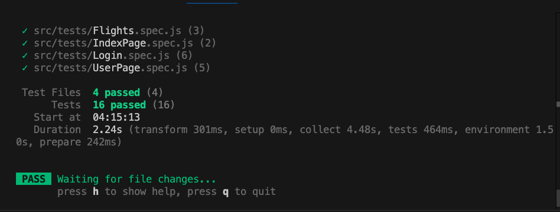

## Login Page with Vue and TDesign

This project is a simple login page created using `Vue.js` for frontend and use `Django` for backend, and using `vitest` to write test scripts.

It includes simulated authentication with visual feedback on login status and input validation.

In some of the comments, we have chosen to use bilingualism.

### Main Prerequisites

Before running this project, make sure you have the following installed on your system:

- Node.js (v16.x or higher recommended)
- npm (comes with Node.js)

### Getting Started

1. Clone the repository:

   ```bash
   git clone https://github.com/mentlesoul/CISC327-Group-22-TA.git
   cd CISC327-Group-22-TA\Assignment-3
   ```

2. Installation dependencies:

   At the root directory, thus `Assignment-3` folder, run bash/shell command below:

   ```properties
   npm install
   ```

3. Local development launch:

   ```properties
   npm run dev
   ```

   Visit http://localhost:5173/ to view the page.

   ```properties
   cd backend
   python manage.py runserver
   ```

   To run the Django backend service

4. Run test script:

   ```properties
   npm run test:unit
   ```

### Test Case

- Test Case 1: checking the login form rendering
- Test Case 2-4: Simulate the input of an invalid mailbox and test the mailbox validation logic
- Test Case 5: Simulate the input of the correct account and password, test the status change of the button and the processing logic after success
- Test Case 6: Simulate the incorrect account and password, test the status change of the button and the processing logic after the failure


